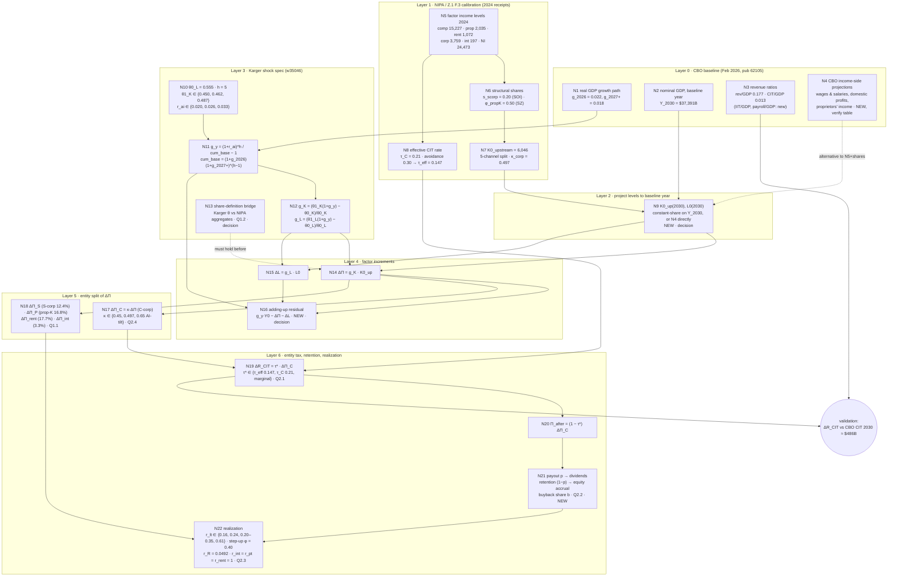
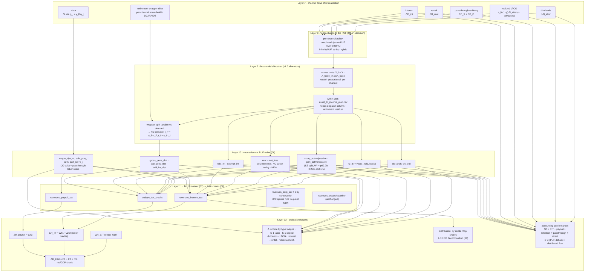

# AI-Fiscal v2 — flow network: CBO baseline → evaluation targets

**Status:** Working artifact, 2026-09-19. Companion to
`v2_architecture.md` (the design plan) — this doc draws the *network*
that plan implies: every equation, parameter, and data source that
has to exist for a number to flow from the CBO baseline projections
down to the quantities we want to evaluate (corporate-tax revenue,
growth in each income type, individual-tax revenue, distribution).
Nothing here is implemented. Node IDs (`N1`…) are referenced from the
tables so a reader can go diagram → registry → code/receipt.

Every node is tagged with one of:

| Tag | Meaning |
|---|---|
| **v1.0** | exists in shipped code (`code/NN_*.R`) and carries over |
| **receipt** | data already pinned in `config/calibration/*.csv` or a yaml leaf |
| **new** | no code and no receipt yet |
| **decision** | shape of the node depends on an open question in `v2_architecture.md` §11 |

Numbers quoted are the 2024 NIPA receipts and the CBO Feb-2026
(pub 62105) leaves already in the repo unless marked *derived here*.

---

## 1. The sizing spine (macro → factor increments → entity flows)

**Reading the spine.** Layers 0–3 are inputs; the only arithmetic is
N11–N12, which already ships in `02_params.R`. Layer 4 is where v2
departs from v1.0: v1.0 computes `X = g_K · Y0^K` on the *PUF-realized*
base (`04_allocate_capital.R::compute_macro_targets`), v2 computes ΔΠ
on the *NIPA* base. Everything below Layer 4 is new except the
realization constants in N22, which are calibrated in
`realization_and_wealth_extensions.md` §3–4 and
`config/retirement_calibration.yaml`.

---

## 2. The household leg (entity flows → PUF lines → microsim → targets)

---

## 3. Node registry — equations

| Node | Equation / operation | Inputs | Output | Home | Tag |
|---|---|---|---|---|---|
| N11 | `cum_base = (1+g_2026)(1+g_2027+)^(h−1)`; `g_y = (1+r_ai)^h / cum_base − 1` | N1, N10 | g_y | `02_params.R` | v1.0 |
| N12 | `g_K = (θ1_K(1+g_y) − θ0_K)/θ0_K`; `g_L = (θ1_L(1+g_y) − θ0_L)/θ0_L`; share_mode F pins θ1_K = θ0_K | N10, N11 | g_K, g_L | `02_params.R` | v1.0 |
| N7 | `K0_up = CP·(1−s_scorp) + CP·s_scorp + PI·φ_propK + RI + NI_int`; `κ = CP(1−s_scorp)/K0_up` | N5, N6 | K0_up, κ, channel shares | `kappa_corp_calculation.csv` | receipt |
| N8 | `τ_eff = FedCIT / (PBT·(1−s_scorp))`; `avoidance = (τ_C − τ_eff)/τ_C` | N5, N6 | τ_eff | `cit_avoidance_calculation.csv` | receipt |
| N9 | `K0_up(2030) = K0_up(2024) · Y_2030/Y_2024` (constant share) **or** channel levels from N4 | N2, N5, N7 or N4 | K0_up(2030), L0(2030) | none | new · decision |
| N13 | Map Karger θ0_L to a NIPA aggregate. Candidate: `(comp + φ_propK·PI)/GDP = (15,227 + 1,018)/29,185 ≈ 0.557` vs Karger 0.555 *(derived here — hypothesis, verify against w35046 Tbl 39 definition)* | N5, N10 | consistent (Y, L0, K0) triple | none | new · decision |
| N14 | `ΔΠ = g_K · K0_up` | N9, N12 | ΔΠ | replaces `compute_macro_targets` | new |
| N15 | `ΔL = g_L · L0`; passed to Step A as `L1 = L0 + ΔL` | N9, N12 | L1 | `03_shock_labor.R` (takes L1) | v1.0 (interface change) |
| N16 | `resid = g_y·Y0 − ΔΠ − ΔL`. Zero only if `L0 + K0_up = Y0` in the same accounting. With NIPA 2024: L0/NI 0.622, K0_up/NI 0.247, residual 0.131 (taxes on production, business transfers, gov-enterprise surplus) | N11, N14, N15 | residual, assertion | none | new · decision |
| N17 | `ΔΠ_C = κ · ΔΠ`, κ baseline or AI-tilt | N7, N14 | ΔΠ_C | none | new |
| N18 | `ΔΠ_j = share_j · ΔΠ` for j ∈ {S-corp, prop-K, rent, int} | N7, N14 | four channel increments | none | new |
| N19 | `ΔR_CIT = τ* · ΔΠ_C` | N8, N17 | ΔR_CIT | none; retires `09` wedge (`09_tables_figures.R:227` tripwire flips) | new · decision |
| N20 | `Π_after = (1 − τ*) ΔΠ_C` | N19 | Π_after | none | new |
| N21 | `div = p·Π_after`; `ret = (1−p)·Π_after`; optional `buyback = b·ret` taxed as realization | N20, p, b | dividend flow, accrual flow | none (`scale_gross` hook in 06 sidecar) | new · decision |
| N22 | `LTCG_realized = r_lt · ret`; lifetime factor `1 − (1−r_lt)·φ`; retirement `r_R·ΔW_ret`, split `s_P/s_I`, taxable `τ_P/τ_I`; `r = 1` for interest, pass-through, rental | N21, N18, realization constants | per-channel realized flows | `05_realization.R` (placeholder) | new; constants in receipts |
| R1 | per channel: `flow_PUF = flow_NIPA` (benchmark) or `flow_PUF = flow_NIPA · PUF0/NIPA0` (inherit) | L7 flows, SOI/PUF baselines | flows sized to PUF | none | new · decision |
| A1 | `X_i = X · A_base_i / Σ w_i A_base_i`, A_base = `.ASSET_BASE_ALL_ASSETS`; per channel against the channel's holdings base | R1 | X_i per channel | `04::allocate_across_units` | v1.0 (per-channel loop new) |
| A2 | `X_type_i = X_class_i · share(class, type)`; residual → retirement | A1, `asset_to_income_map.csv` | X_qualified_div, X_ltcg_gross, X_taxable_int, X_tax_exempt_int, X_passthrough_ordinary, X_retirement | `04::map_to_income_types` | v1.0 (needs dispatch column) |
| A3 | `F_i = X_retirement_i`; `X_pens_txbl = t_P F_i`, `X_ira_txbl = t_I F_i`, `t_P = s_P τ_P`, `t_I = s_I τ_I` | A2, retirement yaml | retirement PUF deltas | `04` R1 cascade | v1.0 |
| P3 | SZ split at W* = p99.99 of positive wages: capital share 0.25 below, 0.75 above, 0.75 passive; `.update_passthrough(pos, loss, cap_share, ρ, flow)` | A2, C7 | scorp/part active/passive | `06_build_counterfactual.R` | v1.0 |
| P7 | `ρ_i = y_l1/y_l` applied to 20 labor columns + passthrough labor share | N15 via Step A | scaled labor lines | `06_build_counterfactual.R:27-45` | v1.0 |
| E2 | `ΔR_IIT = Δ revenues_income_tax − Δ outlays_tax_credits` (matches `08` `total` definition) | T1, T2 | ΔR_IIT | `08_aggregate.R:173-175` | v1.0 |
| E4 | `ΔR_total = ΔR_CIT + ΔR_IIT + ΔR_payroll (+ estate/other ≈ 0)` | E1–E3 | headline | `09` | v1.0 (source of ΔR_CIT changes) |
| E7 | `ΔΠ = ΔR_CIT + div + ret + ΔΠ_S + ΔΠ_P + ΔΠ_rent + ΔΠ_int`; `Σ w·ΔPUF = Σ realized flows` | all | pass/fail | `check_capital_contract()` (to write) | new |

---

## 4. Node registry — parameters

| Symbol | Value(s) | Node | Source | Status in repo |
|---|---|---|---|---|
| g_2026, g_2027+ | 0.022, 0.018 | N1 | CBO 62105 Tbl 1 | yaml, sourced |
| Y_2030 | $37,391B | N2 | CBO 62105 | yaml, sourced |
| rev/GDP, CIT/GDP (2030) | 0.177, 0.013 | N3 | CBO 62105 Tbl 1 | yaml, sourced |
| IIT/GDP, payroll/GDP (2030) | — | N3 | CBO revenue projections by category | **new** (benchmarks CSV has interpolated 3,200 / 470; CIT 470 conflicts with 0.013×37,391 = 486) |
| h | 5 (2025→2030) | N10 | choice | yaml |
| θ0_L | 0.555 | N10 | Karger Tbl 39, 2025 | yaml, sourced |
| θ1_K (S/M/R) | 0.450 / 0.462 / 0.487 | N10 | 1 − Karger Tbl 39 2030 labor share | yaml, sourced |
| r_ai (S/M/R) | 0.020 / 0.026 / 0.033 | N10 | Karger Tbl 19 median | yaml, sourced |
| g_y (S/M/R) | ≈ 0.006 / 0.036 / 0.072 *(derived here)* | N11 | — | code-derived; cross-check `13_macro_params_table.R` |
| g_K (S/M/R) | ≈ 0.017 / 0.075 / 0.173 *(derived here)* | N12 | — | code-derived |
| g_L (S/M/R) | ≈ −0.003 / 0.004 / −0.009 *(derived here)* | N12 | — | code-derived |
| s_scorp | 0.20 | N6 | IRS SOI corporate stats | receipt, preliminary |
| φ_propK | 0.50 | N6 | Saez-Zucman 2020 | receipt, preliminary |
| κ_corp | 0.497 (0.45 / 0.65 sens.) | N7, N17 | receipt | yaml 0.50, preliminary |
| channel shares | C 0.497 · S 0.124 · P 0.168 · rent 0.177 · int 0.033 | N18 | receipt | receipt (not yet a yaml leaf) |
| τ_C | 0.21 | N8 | IRC §11 | yaml, sourced |
| avoidance | 0.30 (0.25 / 0.55 sens.) | N8 | receipt (NIPA narrow; JCT / GAO bounds) | receipt |
| τ_eff | 0.147 (0.0945–0.1575) | N8, N19 | derived | receipt |
| τ* choice | τ_eff / τ_C / marginal | N19 | Q2.1 | **decision** |
| p (payout) | to pull: NIPA Tbl 1.12 net dividends / profits after tax; design doc says ≈0.4–0.5 (unverified) | N21 | NIPA 1.12 | **new** |
| b (buyback share) | to pull: Z.1 net equity issuance / Compustat | N21 | Q2.2 | **new** |
| r_lt | 0.61 lifetime (CRS R41364) · 0.24 (CBO 58914) · 0.16 (PUF 2030) · 0.20–0.35 (JCT/AH) | N22 | realization doc §3 | documented, no yaml leaf |
| φ (step-up haircut) | 0.40 | N22 | realization doc §3.4 | documented |
| r_R, s_P, s_I, τ_P, τ_I | 0.0492, 0.7538, 0.2462, 0.5965, 0.8770 | N22, A3 | SOI 1304 Tbl 1.4 + IRA Bulletin + DFA (TY2022) | yaml, sourced |
| public-equity split | 0.30 qualified div / 0.70 LTCG | A2 | `asset_to_income_map.csv` | **superseded by p and r_lt under v2 — one definition per computation** |
| W*, SZ capital shares | p99.99; 0.25 / 0.75 / 0.75 | P3 | Saez-Zucman 2020 | yaml, preliminary |
| k (S2/S3 dispersion) | 1.0 | Step A | `k_calibration_memo.md` | yaml, preliminary |

---

## 5. Node registry — data sources

| Source | Vintage | Feeds | Have it? |
|---|---|---|---|
| CBO Budget & Economic Outlook, pub 62105, Tbl 1 | Feb 2026 | N1, N2, N3 | yes (yaml leaves) |
| CBO 10-Year Economic Projections xlsx — income block (wages & salaries, domestic economic profits, proprietors' income; possibly rental / interest / dividends) | Feb 2026 | N4 → N9 | **pull; verify which income lines the Feb-2026 file carries** |
| CBO Revenue Projections by Category (IIT, payroll, CIT by FY) | Feb 2026 | N3 validation, E4 | **pull**; replaces the interpolated 2030 benchmark rows |
| Fed Z.1 Table F.3 (national income by type) | 2024 (release 2025-03-13) | N5 | yes, `nipa_2024_z1_f3.csv` |
| BEA NIPA Table 1.12 (profits before tax, taxes, after tax, net dividends, undistributed) | 2024 | N8, **N21 (p)** | PBT + fed CIT yes; dividends / undistributed **pull** |
| IRS SOI corporate stats (S-corp share of profits) | ~2022 | N6 | receipt, preliminary |
| Karger et al. NBER w35046 Tbls 19, 39 | 2026 | N10, N13 | yes (yaml) |
| CRS R41364 (realizations/accruals 61%) | Mar 2026 update | N22 | documented |
| CBO pub 58914 (realized gains 3.7% GDP) | Feb 2023 | N22 | documented |
| SOI Pub 1304 Tbl 1.4; SOI IRA Bulletin Tbl 1; DFA pension entitlements | TY2022 | N22, A3 | yes (retirement yaml) |
| SOI Pub 1304 line totals (wages, interest, dividends, gains, Sch C/E, pensions, IRA, SS) | TY2022 | R1 (PUF vs NIPA gap), validation | yes, `validation_benchmarks.csv` |
| DFA / SCF top-share holdings | 2022 / Q4 2024 | A1 validation | yes, `validation_benchmarks.csv` |
| Tax-Data 2030 tax-unit file (PUF+SCF aged) | vintage `202607091035` | A1–P7 | cluster |
| Tax-Simulator (`state-tax` @ `ab45a6661` local) | — | T1–T5 | local clone |

---

## 6. Evaluation targets and what pins each

| Target | Definition | Pinned by | Benchmark |
|---|---|---|---|
| **Corporate tax** ΔR_CIT | N19 | τ*, κ, ΔΠ | CBO CIT 2030 ≈ $486B; CIT per $ of ΔΠ: 0.073 (τ_eff·κ), 0.096 (τ_eff·0.65), 0.104 (τ_C·κ) |
| **Corporate income growth** | ΔΠ_C / Π_C(2030) | N9, N14, N17 | CBO domestic economic profits path (N4) |
| **Dividend income growth** | div / PUF `div_ord+div_pref` baseline | p, R1 | SOI 2022 ordinary dividends $412B |
| **Realized-gains growth** | LTCG_realized / `kg_lt` baseline | p, r_lt, φ | SOI 2022 net gains $1,241B; CBO 3.7% GDP |
| **Pass-through income growth** | (ΔΠ_S + ΔΠ_P) / Sch E + Sch C baseline | φ_propK, s_scorp, SZ split | SOI 2022 Sch E $1,031B, Sch C $410B |
| **Rental income growth** | ΔΠ_rent / `rent − rent_loss` baseline | Q1.1 (in or out), R1, **P4 writer** | NIPA rental $1,072B vs SOI Sch E rental (to pull) |
| **Interest income growth** | ΔΠ_int / `txbl_int + exempt_int` | Q1.1, exempt share | SOI 2022 taxable interest $134B |
| **Retirement distributions** | X_pens/X_ira | A3, r_R | SOI 2022 pensions $912B, IRA $438B |
| **Wage growth** | ΔL / wages baseline | g_L, Step A form | SOI 2022 wages $9,739B; NIPA comp $15,227B |
| **Individual income tax** ΔR_IIT | E2 | all PUF lines | CBO IIT 2030 (pull) |
| **Payroll** ΔR_payroll | E3 | P7 | CBO payroll 2030 (pull) |
| **Total / rev-GDP** | E4 | — | 0.177 × Y_2030 |
| **Distribution** | E6 | A1 wealth base, Step A | DFA top-1% equity share 0.499 |

---

## 7. Decisions that change the network's shape

| Decision | Nodes affected | Options | What it moves |
|---|---|---|---|
| Q1.1 base | N7, N18 | broad $6,046B vs business-only $4,777B (drop rent + int) | ΔΠ by −21%; whether P4 writer is needed |
| Q1.2 share bridge | N13, N16 | comp/GDP-style vs NI-style θ; explicit Y | whether ΔΠ + ΔL = g_y·Y closes |
| Q1.3 reconciliation | R1 | benchmark / inherit / hybrid per channel | level of every PUF delta |
| Q2.1 τ* | N19 | 0.147 / 0.21 / marginal | ΔR_CIT ± ~40% |
| Q2.2 p, b | N21 | dividends vs buybacks | dividend vs LTCG routing, timing |
| Q2.3 r_lt concept | N22 | annual (0.16–0.35) vs lifetime (0.61) | realized LTCG by up to 4× |
| Q2.4 κ tilt | N17 | 0.497 vs 0.65 | ΔR_CIT +31%, pass-through share down |
| N9 method | N9 | constant-share scaling vs CBO income projections | 2030 base levels |

---

## 8. Gaps this network exposes (not in `v2_architecture.md`)

1. **Adding-up fails by construction (N16).** The θ arithmetic in N12
   yields `ΔΠ + ΔL = g_y·Y0` only when `L0 + K0 = Y0`. NIPA
   compensation plus the broad capital base is 87% of national income;
   the remainder is taxes on production, business transfers, and
   government-enterprise surplus. Either Y is redefined as `L0 + K0_up`
   (then g_y is not CBO's GDP growth), or the residual gets an explicit
   node. Q1.2 as written covers only the labor side of this.
2. **Rental has no landing column writer (P4).** The tax-unit file
   carries `rent`/`rent_loss` (`data_requirements.md:64`) but
   `06_build_counterfactual.R` never writes them and
   `asset_to_income_map.csv` has no rental asset class. The 17.7%
   channel is dead on arrival unless Q1.1 drops it or a writer is added.
3. **Two payout definitions.** `asset_to_income_map.csv` already splits
   public equity 0.30 dividends / 0.70 LTCG. That is an implicit payout
   ratio. Once p exists (N21) the map's split must be derived from p
   and r_lt, not carried alongside.
4. **Baseline-year factor levels (N9) have no method.** §2 lists
   "factor income levels — new" without saying how 2024 NIPA levels
   become 2030 levels. Constant-share scaling on Y_2030 is the minimal
   version; CBO's own income-side projections are the better source
   if the Feb-2026 file carries the lines.
5. **CIT benchmark disagrees with itself.** `validation_benchmarks.csv`
   has CIT 2030 = $470B (interpolated) while the yaml leaves imply
   0.013 × 37,391 = $486B. One should go.
