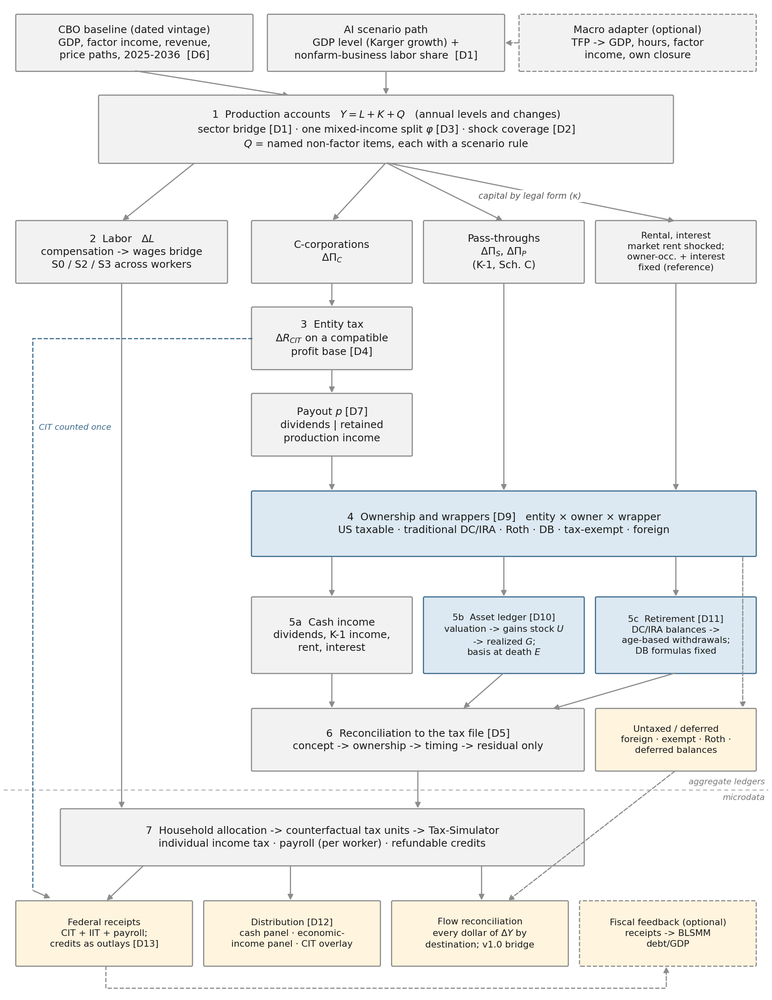
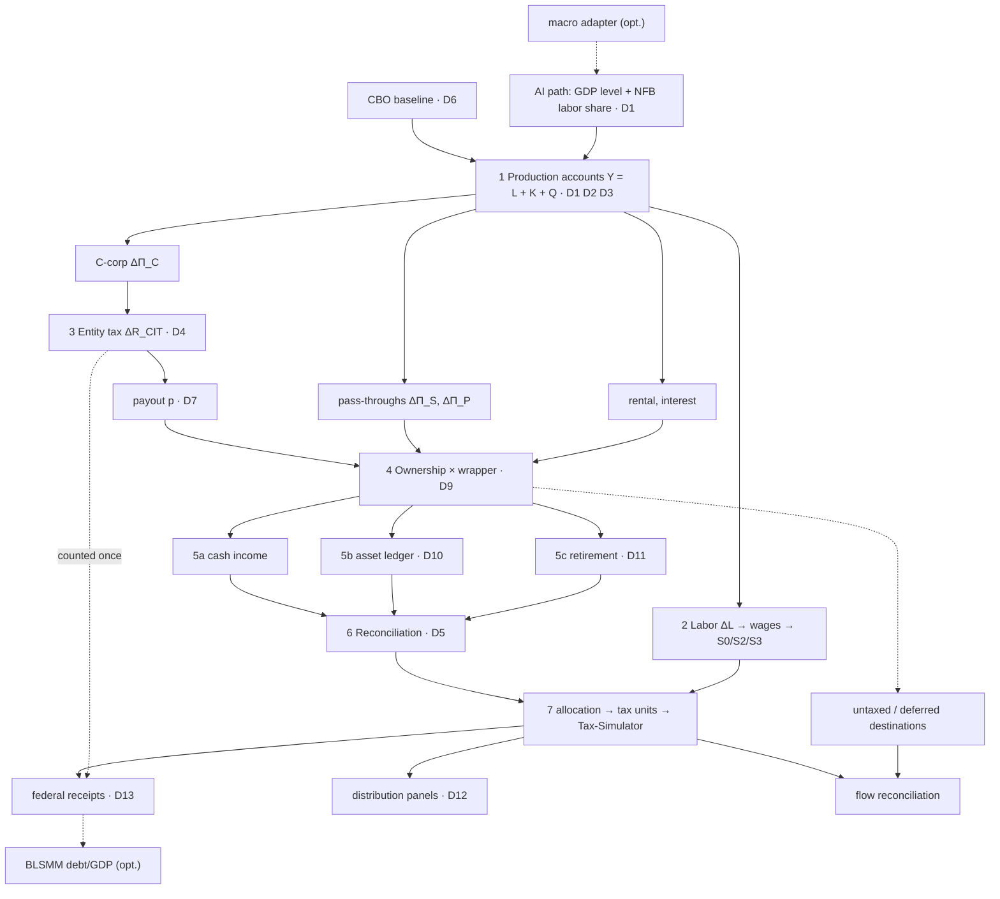

**Status.** Draft for review, 2026-10-02. Nothing in this document is a
SET decision. Every choice cites its entry in
[`v2_decisions.md`](v2_decisions.md) (`[D1]`–`[D13]`), and "reference
case" means the default proposed there — the one to argue against. The
design follows the September 23 review
([`v2_review_and_roadmap.md`](v2_review_and_roadmap.md)). Where this
document and [`v2_flow_network.md`](v2_flow_network.md) disagree, this
one reflects the review and the network has not yet been revised.

**What to review.** (1) whether the estimand in §1 is the question we
want to answer; (2) the reference-case choices in §3, module by module;
(3) the reuse plan in §6 — what we take from existing Budget Lab models
versus build; (4) the questions collected in §8.

---

## 1. The question

> Given an annual path for aggregate output and its split between labor
> and capital, what happens to federal individual income, payroll, and
> corporate income taxes, and to the distribution of household income,
> under current law and explicitly stated transmission assumptions?

v1.0 answered a narrower version: it sized the capital increment on the
tax-return base ($X = g_K Y_0^K$, realized income only), so realization,
ownership, and entity composition were fixed by construction, and CIT
entered as a single macro wedge. v2.0 sizes the shock **upstream** in
the national accounts and follows each dollar to a named destination —
a federal tax, a household (as cash or as accruing value), a retirement
balance, a tax-exempt holder, or a foreign owner.

The research contribution is the **explanation of why the tax system
captures different amounts of an otherwise identical aggregate gain**:
factor shares, legal form, ownership, tax preferences, and timing, each
quantified. v2.0 does *not* forecast AI's aggregate effect (it takes the
Karger et al. path as given) and is not a general-equilibrium model.

The scenario is measured **relative to the CBO baseline** [D6], which
already embeds an AI assumption (+0.1pp/yr productivity); it is not an
AI-versus-no-AI counterfactual. Publication focuses on **2030**, with
annual accounting from the start year; no ten-year score in v2.0 [D13].

---

## 2. Overview: from the AI shock to tax outputs

{width=100%}

The diagram has two halves separated by the dashed rule.

**Above the rule, everything is an aggregate annual ledger.** The shock
enters as a GDP level and a labor-share path (inputs, top). Module 1
turns these into changes in labor income, capital income by channel,
and named non-factor items, on one consistent accounting identity.
Labor goes straight to the microdata. Capital is split by legal form;
C-corporation profits pay CIT (counted once, here — the dashed blue
line), then split into dividends and retained income. Module 4 assigns
every dollar of distributable capital income to an owner and wrapper.
Module 5 turns owner-level flows into three objects: cash income, an
asset ledger of unrealized and realized gains, and retirement balances
with withdrawals. Whatever is foreign-owned, exempt, Roth, or deferred
is reported as a destination and never written onto tax returns.

**Below the rule is the microsimulation.** Module 6 reconciles the
taxable aggregates to the tax file's concepts; module 7 allocates them
to tax units with the v1.0 allocators, writes counterfactual records,
and runs Tax-Simulator. Outputs are federal receipts by instrument, two
distributional panels, and a flow reconciliation that accounts for
every dollar of ΔY.

A Mermaid version of the same structure (renders on GitHub):

---

## 3. Modules

Notation: superscripts `B` (baseline) and `S` (scenario); $\Delta x = x^S - x^B$; `t` indexes calendar years. All ledgers are annual and nominal.
Each module carries **identical rules in baseline and scenario**, and
outputs are differences — no module applies a nonnegativity constraint
to a delta.

### 3.0 Inputs and baseline [D6, D13]

| Input | Reference case | Source |
|---|---|---|
| Baseline macro path, 2025–2036 | CBO February 2026 economic projections: GDP, wages and salaries, domestic economic profits, proprietors' income (and rental, interest, dividends if carried) | CBO pub 62105 + 10-year projections file (data-gathering 2.1–2.3) |
| Baseline revenue path | CBO revenue by source, FY 2025–2036 | data-gathering 2.2 |
| AI GDP path | real GDP level path from Karger Table 19 growth medians (economists' group, pinned vintage [D1]) | NBER w35046 |
| AI labor-share path | Karger Table 39 medians, nonfarm business sector, same respondent group | NBER w35046 |
| Prices | one common price path for the controlled real-growth experiment; CPI and wage indexing kept as separate inputs | CBO |
| Policy | current law at the Tax-Simulator vintage | Tax-Simulator |

The macro adapter (dashed box) is an optional alternative entry point: a
user who wants to supply TFP rather than GDP routes it through a model
with its own closure (employment, investment, factor incomes), which
then supplies the GDP and factor paths. TFP and GDP multipliers are
never applied to the same base.

**What changes from v1.0:** v1.0 used a single 2030 endpoint with
positional growth keys; v2.0 is year-indexed throughout (build plan
1.2).

### 3.1 Production accounts [D1, D2, D3]

The core identity, for each year and for levels and changes alike:

$$Y_t = L_t + K_t + Q_t$$

with all three terms on the same domestic/national, gross/net
convention. `Q` is not a residual: each component is named (taxes on
production and imports less subsidies, business current transfers,
government-enterprise surplus, consumption of fixed capital if gross,
statistical discrepancy) and carries a scenario rule — held fixed in
levels, scaled with output, or shocked.

**Sector bridge [D1].** The survey's labor share is for the nonfarm
business sector (NFB). Write $Y = Y^{NFB} + Y^{O}$. In the reference case
the AI-driven GDP change lands in NFB in proportion to its baseline
share, the survey share applies within NFB, and the other sectors keep
their baseline factor shares:

$$\Delta L^{NFB}_t = \theta^S_t Y^{NFB,S}_t - \theta^B_t Y^{NFB,B}_t, \qquad \Delta K^{NFB}_t = \Delta Y^{NFB}_t - \Delta L^{NFB}_t - \Delta Q^{NFB}_t$$

An alternative national mapping is a required sensitivity. Whether
$\theta^B_t$ is today's share or CBO's projected share is part of D1.

**Mixed income [D3].** Proprietors' income is split with one parameter
`φ` (capital) and `1−φ` (labor), **identically** in the macro accounts
and the micro file (`sole_prop`, `farm`, S-corp lines). The review's
correction: v2's draft network added `φ·PI` to labor, which only works
at φ = 0.5; restoring the labor half takes the unexplained residual
from 13.1% to 8.9% of national income on the 2024 receipt.

**Shock coverage [D2].** The accounts stay complete; the shock is
assigned to channels. Reference case: business capital income shocked;
owner-occupied housing (imputed rent) unshocked; net interest on a
fixed financing-cost path. Market rental and a broader interest
response are sensitivities.

**Labor to wages.** `ΔL` (compensation) becomes taxable wages through a
compensation-to-wages bridge (employer social insurance, pension and
health contributions), held at baseline ratios in the reference case.

**Acceptance:** a baseline table and one toy shock that reconcile
sector coverage, GDP/NI, compensation/wages, mixed income, and each
named `Q` component; the zero shock gives zero deltas everywhere.

### 3.2 Labor distribution (existing S0/S2/S3) [D8]

Unchanged in kind from v1.0, now fed an annual `ΔL` from §3.1: S0
proportional, S2/S3 compressive/expansive log-affine maps. Two changes:
(1) the dispersion parameter is decoupled from GDP growth enough to run
a pure-inequality case at unchanged GDP; (2) nonpositive labor incomes
get explicit treatment (v1.0's `y_l == 0` inert class). Payroll tax is
computed per worker. **Displacement, occupation exposure, and UI are
deferred** [D8]; the output contract keeps worker and tax-unit IDs so
they can be added.

### 3.3 Capital by legal form and the entity tax [D4]

Business capital income splits by legal form:

$$\Delta K^{bus} = \Delta\Pi_C + \Delta\Pi_S + \Delta\Pi_P$$

with reference shares from the 2024 receipt (C-corp 0.497 of the broad
base); a C-corp/rent-concentrated split is sensitivity 2 (Q2.4).

**CIT, two objects [D4].**

- *Baseline bridge.* Economic profits → federal CIT receipts on
  **compatible concepts** — a coarse version of CBO's corporate
  method (pub 59436): profits without IVA/CCAdj, less foreign and
  loss-firm adjustments, less deductions, times the statutory rate,
  less credits; liabilities converted to fiscal-year receipts. This
  fixes the denominator mismatch the review found (14.7% was computed
  on profits without IVA/CCAdj but applied to a base with them: ≈$442B,
  not $492B).
- *Incremental response.* $\Delta R_{CIT} = \tau^m \Delta\Pi_C$, with $\tau^m$ built from
  separately labeled assumptions on profit composition (normal return
  vs rent), investment deductions (permanent 100% bonus depreciation
  after 2025-01-19), loss utilization, and credits. The reference rule
  is labeled as such; sensitivity 5 brackets it.

CIT is added **once**, here, and bypasses the microsimulation (where
the existing Tax-Simulator CIT baseline is carried unchanged).

**Pass-throughs.** No entity tax; taxable distributive share flows to
owners every year whether or not cash is paid. Labor/capital
classification stays separate from legal tax treatment — SE tax and QBI
are applied by the calculator. Pass-through earnings raise basis and are
never taxed again as a retained-earnings gain.

### 3.4 Payout [D7]

$$D = p \cdot \Pi^{AT}_C, \qquad RE = (1-p)\cdot \Pi^{AT}_C, \qquad \Pi^{AT}_C = \Delta\Pi_C - \Delta R_{CIT} - \text{other entity taxes}$$

`p` is measured on a matched universe (that universe's dividends over
its after-tax profits), not personal dividends over all corporate
profits. `RE` is **retained production income**, not a capital gain;
any effect on equity value goes through the asset ledger (§3.6). The
v1.0 0.30/0.70 public-equity split in `asset_to_income_map.csv` is
retired in favor of `p`. Buybacks are deferred but get their own
payout/financing category.

### 3.5 Ownership and wrappers [D9] — *new*

An entity × owner × wrapper matrix $\omega_{e,o}$ with $\sum_o \omega_{e,o} = 1$ for
every entity type `e`. Owner destinations in the reference case: US
taxable households; traditional DC/IRA; Roth; DB pensions; tax-exempt
institutions; foreign owners. Flows to owner `o`:

$$F_{o} = \sum_e \omega_{e,o}\, (D_e + RE_e + \Pi^{PT}_e)$$

Intermediaries (funds, insurers) are looked through with one consistent
rule. Foreign and exempt flows are **reported destinations**, never
renormalized onto PUF households. Calibration: Financial Accounts
sector holdings (note the June 2026 table renumbering), SCF, IRA and
pension aggregates; aggregate shares with sensitivities, no
multinational microsimulation.

Two conservation tests, not one: the sum over all owner destinations
equals the distributable flow; the PUF allocation equals the US
taxable-household flow.

### 3.6 Household income and asset state [D10, D11] — *partly new*

**5a Cash income.** Dividends, taxable distributive shares, market rent,
interest received by US taxable owners.

**5b Asset ledger [D10].** Two ledgers, linked:

- the *production ledger* (§§3.1–3.5) carries current income;
- the *asset ledger* carries claim values, basis, unrealized gains `U`,
  realizations `G`, and gains removed by basis step-up at death `E`:

$$U_{t+1} = U_t + A_t - G_t - E_t$$

where `A_t` is valuation accrual. Reference valuation rule: no
announcement revaluation (accrual tracks retained income — labeled as
an assumption, not an identity); a capitalization case that values a
specified persistent after-tax cash-flow change is the alternative.
Realization `G_t` comes from either a hazard on `U_t` or a distributed
lag on `A`, calibrated on matched asset universes against multi-year
realizations. Order within the year: accrual, then sales, then deaths.
Gains stay **outside** the GDP identity. The CRS 61% figure is a
long-run realizations-to-accruals ratio, not an annual hazard or a
lifetime probability; the 0.84 "lifetime factor" is dropped.

**5c Retirement [D11].** Incremental traditional DC/IRA balances
accumulate the wrapper's share of returns and pay out through an
age-sensitive withdrawal rule (or a documented aggregate
approximation); Roth separate and untaxed on qualified withdrawal; DB
benefit formulas fixed in the near term, with sponsor/funding gains
reported separately. Balances live in age × owner × wrapper cells, not
in a pretend household panel. The v1.0 `R1` cascade is reused only to
allocate the resulting taxable withdrawals across units.

### 3.7 Reconciliation to the tax file [D5]

Applied in a fixed order, each step with a named purpose:

1. **Concept and coverage** — imputed rent out; NIPA net interest →
   household interest; dividend concept (confirm whether Tax-Data's
   `div_ord` includes qualified dividends).
2. **Ownership and wrappers** — already done in §3.5.
3. **Timing and realization** — already done in §3.6.
4. **Measurement residual** — a final factor that covers *only* the
   gap left after 1–3, by channel, on comparable universes and years.
   Additive where denominators are near zero or change sign.

The historical SOI/NIPA ratio is evidence for step 4, not a
multiplier on top of steps 2–3 (it already contains them).

### 3.8 Microsimulation

Reuses the v1.0 machinery: across-unit allocation by each channel's
holdings base, within-unit mapping to tax lines, the counterfactual
writer (`06`), and Tax-Simulator via `callr` (`07`). New writer
columns as needed (market rental; per-channel dispatch). Tax-Simulator's
fiscal-year adjustment drops the earliest year, so each reported year
needs its adjacent tax-year file — to be confirmed against the vintage
in week 1.

### 3.9 Outputs [D12, D13]

- **Federal receipts by instrument:** $\Delta R = \Delta R_{CIT} + \Delta R_{IIT} + \Delta R_{payroll}$,
  with refundable-credit outlays reported separately before any net
  fiscal measure. Revenue-to-GDP change
  $\Delta z = (\Delta R/Y_0 - z_0 g)/(1+g)$ shown alongside dollar levels.
- **Distribution [D12]:** (a) disposable cash income; (b) accrual-based
  economic income that attributes retained income and deferred returns
  once. Valuation changes reported separately. CIT is already deducted
  before allocation, so no second burden deduction; alternative
  incidence conventions (OTA, TPC, CBO) as a reconciled overlay.
  Households ranked by baseline income.
- **Flow reconciliation:** every dollar of ΔY by destination (federal
  tax by instrument, household cash, accruing value, retirement
  balances, exempt, foreign, `Q`).
- **v1.0 comparison:** headline change decomposed by mechanism (source
  corrections, base, entity tax, ownership, realization, retirement,
  allocation, income concept), in a fixed order with the interaction
  remainder shown.
- **Optional:** debt/GDP through BLSMM (§6).

---

## 4. Scenarios and sensitivities

**Reference grid.** Keep the three Karger growth cases (slow / moderate
/ rapid) and the changing-share vs fixed-share comparison, with S0 as
the reference labor distribution and S2/S3 as distributional variants.

**Structural sensitivities** (the review's list, run as local
perturbations around the reference set, then two or three coherent
combined cases — scenario ranges, not probability intervals):

| # | Sensitivity | Decision |
|---|---|---|
| 1 | Survey group, sector-to-national mapping, baseline-share path | D1 |
| 2 | Economy-wide vs C-corp/rent-concentrated marginal profits | Q2.4 |
| 3 | Resident vs foreign; traditional / Roth / exempt proportions | D9 |
| 4 | Gains: announcement timing, realization schedule, matched-coverage calibration | D10 |
| 5 | CIT: normal-return/investment-heavy vs rent-heavy; loss utilization | D4 |
| 6 | Household allocation: wealth- vs income-based; top tail; S2/S3 | — |
| 7 | Retirement withdrawal response; DB treatment; prices/indexing | D11, D6 |

---

## 5. Validation

Four kinds of evidence, kept separate:

1. **Accounting.** Every identity holds in baseline and scenario
   (production, entity, ownership, household allocation, asset state);
   zero shock → zero deltas; every dollar excluded from one base appears
   in a named destination; CIT counted once. These are blocking.
2. **Implementation.** Row-order invariance; scenario runs leave the
   baseline untouched; unknown channels fail loudly; single-channel
   tests for qualified/ordinary dividends, SE income, rental losses,
   loss carryforwards, NIIT, QBI, per-worker payroll caps.
3. **Economic.** Baseline levels against matched-year, matched-concept
   benchmarks (SOI, BEA, CBO); scenario deltas checked against their
   mechanism, not against CBO levels. Calibration to CBO is not
   validation against CBO. Gaps get documented dispositions, not
   automatic failures.
4. **Publication.** Reproduce v1.0 on its original vintage; decompose
   the v1.0 → v2.0 change by mechanism. Matching the old headline is
   not a completion criterion.

The review's $100 example (Appendix A) and its all-foreign,
all-retirement, zero-dividend, and intermediary variants are the module
tests for §§3.3–3.5.

---

## 6. Building on existing Budget Lab models

**Short answer.** The *top* of the pipeline (the CBO baseline) and the
*bottom* (tax calculation, CIT incidence, debt/GDP) can come largely
from existing Budget Lab models. The *middle* — the stages that are the
point of v2 (factor-share shock, legal form, payout, ownership,
realization, retirement timing) — has no Budget Lab equivalent and must
be built. No existing Budget Lab model has a labor-share or
C-corp-vs-pass-through mechanism.

Checked 2026-10-02 against the public Budget-Lab-Yale repos and the
local clones of Tax-Simulator (`state-tax`) and Tax-Data. Items marked
*unverified* were not confirmed against source.

### 6.1 Reuse directly

**Macro-Projections → the baseline module (§3.0) [D6].**
[`Budget-Lab-Yale/Macro-Projections`](https://github.com/Budget-Lab-Yale/Macro-Projections)
already ingests CBO's 10-year economic projections, revenue
projections, and long-term outlook, and writes `projections.csv` with,
by year: GDP (calendar and fiscal), **compensation, wages, proprietors'
income (farm/nonfarm), rent, interest, personal dividends, corporate
profits (`corp_profits_adj`)**, prices, rates, and **revenue by source
(`rev_iit`, `rev_payroll`, `rev_corp`, …)**. Years past CBO's window are
extended at constant GDP shares. Tax-Simulator and Tax-Data already
read the same vintage (`v3/2026022522`, pinned in Tax-Simulator's
`interface_versions.yaml`).

- *What it saves:* most of the Phase 0 data-gathering §2 pulls (2.1–2.3),
  the hand-built `cbo_baseline.csv` of build step 1.1, and the
  interpolated 3,200 / 470 benchmark rows (settles build-plan 0.10).
- *Why it's better than a hand pull:* the AI-Fiscal baseline, Tax-Data's
  aging, and Tax-Simulator's CIT level would all sit on **one vintage
  by construction**.
- *Check before use:* whether `corp_profits_adj` is domestic economic
  profits (with IVA/CCAdj) or a broader concept — this is exactly the
  denominator D4 needs to get right. *Unverified.*
- *Doesn't cover:* realizations, the S-corp split, NIPA 1.12 payout /
  undistributed profits, an NFB labor share.

**Tax-Data `resources/cbo_1040.csv` → reconciliation and gains [D5, D10].**
CBO projections of 1040 line items, 2019–2036 (wages, taxable interest
+ ordinary dividends, qualified dividends, taxable gains, pass-through,
pensions, Social Security, UI). This is the PUF-side baseline the
reconciliation residual (§3.7 step 4) is measured against, and CBO's
realized-gains path for calibrating §3.6. Its source publication isn't
documented in the repo — *provenance unverified*. Note the route **not**
to take: defining an "AI" Macro-Projections vintage and re-aging the
PUF through Tax-Data would move lines uniformly with no ownership or
distributional allocation, which defeats the purpose.

**Tax-Simulator → the calculator and a CIT-incidence rule [D12].**
Already the calculator (§3.8). Two further pieces are reusable:

- `src/data/post_processing/distribution.R:232` already allocates
  corporate-tax changes between labor and capital income, with the
  labor share phasing from 0 to 20% over ten years (`:484`). That gives
  a **Budget Lab house incidence convention** to sit alongside OTA /
  TPC / CBO in the D12 overlay, and code to adapt rather than write.
- `revenue.R` confirms that `revenues_corp_tax` is a Macro-Projections
  level pass-through (`:52`), so v2's incremental CIT is added outside
  it, once.
- **Conflict to resolve in D3:** the same module defines labor income
  as `wages + 0.8 × (sole_prop + part_scorp + farm)` and capital as the
  other 0.2 (`distribution.R:140-141`). That is a third mixed-income
  convention next to the macro receipt's φ = 0.5 and AI-Fiscal's
  Saez–Zucman split. The distributional panels should use the same φ as
  the production accounts, or say why not.

**BLSMM → fiscal feedback, downstream only.**
The [Small Macro Model](https://budgetlab.yale.edu/research/budget-lab-small-macro-model-blsmm)
([code](https://github.com/Budget-Lab-Yale/Budget-Lab-Small-Macro-Model))
is an annual FY2026–35 model anchored to CBO: output gap, Okun's law,
Phillips curve, Taylor rule, term premium, effective rate on debt,
receipts as a share of GDP, outlays by CBO rules of thumb. It has **no
factor-income, profits, or tax-composition detail**, so it cannot size
the shock. It is the right consumer of v2's output, and v1.0 already
uses it that way (`code/15_blsmm_debt_gdp.R`: revenue/GDP delta → BLSMM
receipts, plus a productivity bump calibrated to Karger growth). Its
companion article on AI says receipts/GDP is "minimally affected" under
rules of thumb and flags that AI could interact with the tax system
"because capital is more lightly taxed than labor" — the question
AI-Fiscal answers.

- *Proposed change for v2:* BLSMM now ships its own Karger-based AI
  scenarios (`scenarios/inputs/ai_slow.R`, `ai_rapid.R`,
  `ai_s1_productivity.R`, `ai_s2_prod_lf.R`, …). Have v2 consume
  those productivity paths rather than re-solving for its own bump in
  `15`, so BLSMM's published AI article and AI-Fiscal describe the same
  scenario. Whether BLSMM's GDP path should also *be* v2's AI GDP input
  (the "macro adapter" in §3.0) is question 6 below.

### 6.2 Adapt

| Model | What it could supply | v2 stage | Effort / caveat |
|---|---|---|---|
| [Cost-Recovery-Simulator](https://github.com/Budget-Lab-Yale/Cost-Recovery-Simulator) (feeds Tax-Simulator) | Depreciation / expensing revenue deltas, C-corp vs pass-through | Incremental CIT `τ^m`, investment-deduction component [D4] | Needs an AI-investment input path; replaces a hand receipt for bonus depreciation |
| CBO rules-of-thumb code in Tariff-Model (`src/07_calculate_dynamic_revenue.R`) | Growth → revenue feedback | Optional macro feedback | Only if v2 wants feedback outside BLSMM |
| FRB/US helpers ([`Budget-Lab-Yale/FRBUS`](https://github.com/Budget-Lab-Yale/FRBUS)) | Dynamic personal and corporate tax bases | Macro adapter (later release) | Whether the setup can take a factor-share shock is *unverified* |
| `AI_Exposure_Metrics` (private), `AI-Employment-Model` (public) | SOC-level exposure | Labor extension (deferred, D8) | Inferred from names and file lists only; confirm with the tracker team |
| Buy-Borrow-Die-Estimates, Estate-Tax-Distribution | Unrealized gains by holder; inheritances | Basis at death `E`, gains stock `U` [D10] | Conceptual inputs; check vintages and concepts |

### 6.3 Build new

None of the following exists elsewhere in the Budget Lab:

- the sector bridge and production accounts with named `Q` (§3.1)
- the legal-form split of capital income (§3.3)
- the CIT baseline bridge and incremental-rate logic (§3.3); Cost-Recovery
  supplies one input
- payout on a matched universe (§3.4)
- the ownership × wrapper matrix (§3.5)
- the asset ledger and the retirement balance/withdrawal module (§3.6)
- the ordered reconciliation (§3.7)
- the flow-reconciliation output and conservation checks (§3.9, §5)

These are also the stages the review identified as the research
contribution, so building them is expected rather than a cost overrun.

### 6.4 Effect on the plan

Adopting Macro-Projections as the baseline is the one change with
immediate schedule value: it moves most of weeks 1–2's CBO data work to
"check one column definition and pin a vintage." It also implies a
small interface change — declare Macro-Projections as a dependency
alongside Tax-Data (this is the "revisit `config/interfaces/` in Phase
1" item in `v2_decisions.md` Appendix A).

---

## 7. Out of scope for v2.0

Occupation exposure and displacement (D8); UI and spending responses;
endogenous GDP, investment, and interest-rate feedback (the macro
adapter is an input contract, not a model); behavioral responses to tax
changes; multinational and firm-level corporate microsimulation;
full lifecycle retirement and estate modeling; endogenous buybacks and
portfolio choice. Each has a hook kept in v2.0 so it can be added (see
review, "What belongs in Version 2 and what should wait").

---

## 8. Questions for review

1. **Estimand.** Is "relative to CBO, 2030 focus, annual accounting" the
   right release contract [D6, D13]? Do we want any years past 2030 in
   the published tables?
2. **Survey vintage [D1].** If the economists' column (55/54/52) rather
   than the pooled column we used in v1.0 is the right one, do we issue
   an erratum for v1.0 or note it only in the v2.0 comparison?
3. **Reference valuation rule [D10].** Zero-announcement revaluation as
   the reference case, capitalization as the sensitivity — or the
   reverse?
4. **Ownership granularity [D9].** Aggregate shares by entity type only,
   or also by wealth group (which interacts with sensitivity 6)?
5. **Distributional headline [D12].** Which panel leads — cash or
   economic income?
6. **Reuse (§6).** (a) Adopt Macro-Projections as the v2 baseline
   module? (b) Should BLSMM's AI scenarios supply v2's GDP path (so one
   scenario definition drives both models), or only its debt/GDP step?
   (c) Which incidence convention leads D12 — Tax-Simulator's house rule
   (0→20% labor) or one of OTA / TPC / CBO?
7. **Mixed income [D3].** Three conventions are in use (macro φ = 0.5,
   Tax-Simulator's 0.8 labor in distribution tables, Saez–Zucman in
   AI-Fiscal's pass-through writer). Which one becomes the single φ?

---

## Appendix A — the $100 design test

From the review, illustrative numbers only. An extra $100 of C-corp
economic profit pays $20 of federal CIT. Of the remaining $80, $40 is
paid as dividends and $40 retained. Ownership: US taxable 50%,
traditional retirement 30%, foreign 20%. Household dividend rate 15%;
no retirement withdrawals or realizations this year.

| Destination | Dividends | Retained (attributed) | Total after entity tax |
|---|---:|---:|---:|
| US taxable owners | $20 | $20 | $40 |
| Traditional retirement | $12 | $12 | $24 |
| Foreign owners | $8 | $8 | $16 |
| **All owners** | **$40** | **$40** | **$80** |

Federal receipts rise $23 ($20 CIT + $3 dividend tax). US owners keep
$61 of after-tax economic income ($24 of it accruing inside retirement
accounts); foreign owners $16. $23 + $61 + $16 = $100. Taxable gains
would need a valuation and realization rule — they cannot be read off
the $40 retained.
